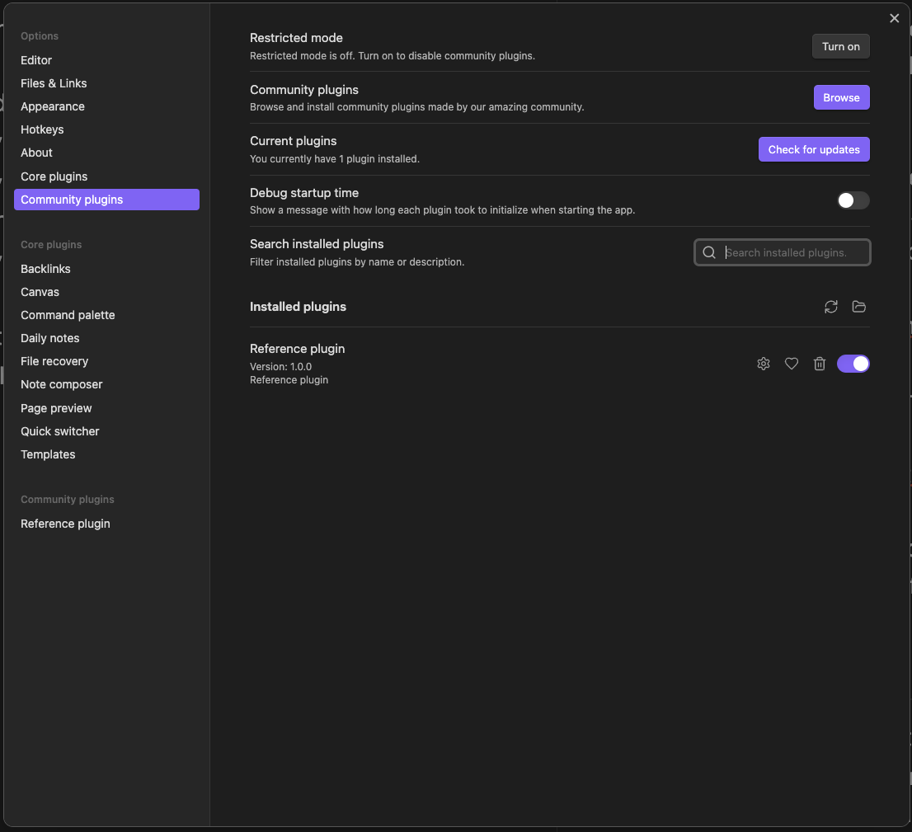

# Latticework Prototype

This repository contains a research prototype of Latticework, implemented as an Obsidian plugin. Latticework is a system designed to unify annotation with freeform text editing in the context of personal knowledge management tools.

You can read more about its goals and design the research report: [https://www.matthewsiu.com/Latticework](https://www.matthewsiu.com/Latticework)

## Important Note

This prototype is an experimental implementation that doesn't fully realize all the features described in our research report. We're sharing it primarily as a reference to provide insights into our research process and to illustrate some of the concepts discussed.

We recommend against building directly upon this codebase. Instead, we encourage using this prototype as inspiration for future implementations of these ideas.

## To install

In your obsidian vault, open the hidden `plugins` folder.

- You can access this folder via the `Community plugins` tab in the settings menu of Obsidian
- Then clicking on the folder icon next to the section titled `installed plugins`

Clone this repository into the `plugins` folder

Run this plugin in test mode by installing `npm install` and running the plugin `npm run dev`

Then, back in the `Community plugins` tab, make sure that the plugin has been activated

## Commands

CMD+Shift+C -> Copy the selected text with a reference

Hover over a reference to peek. Click to keep in view.

CMD+Click on a reference -> Will toggle the text in the reference on and off
